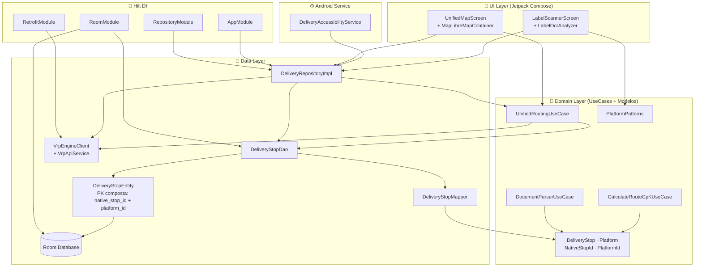
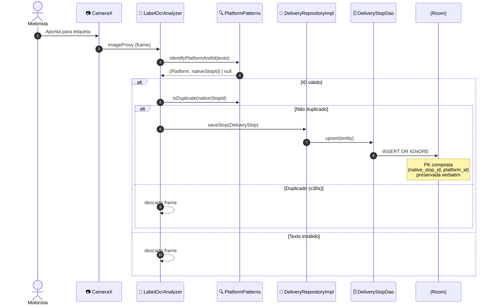
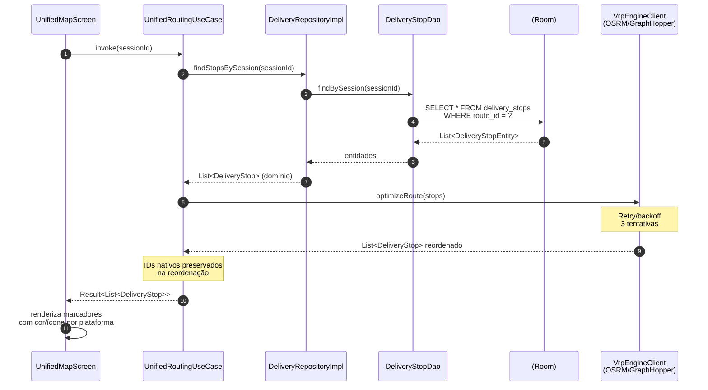
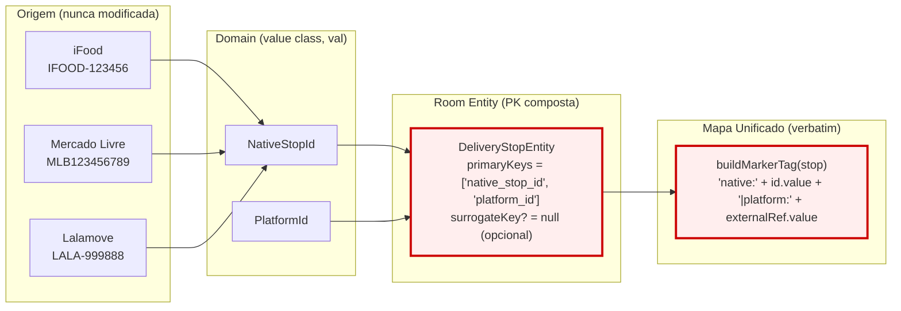
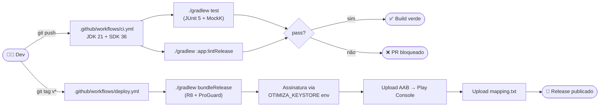
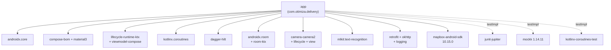

# Otimiza AI — Arquitetura

> Documento visual da arquitetura: **camadas Clean**, **fluxo de imutabilidade do ID nativo**, **pipeline CI/CD**.

---

## 1. Visão geral — Camadas



---

## 2. Fluxo de captura (Edge AI → Banco Local)



---

## 3. Otimização VRP concorrente multi-plataforma



---

## 4. Imutabilidade do ID nativo (Diretriz Crítica #1)



**Garantias:**
- `NativeStopId` e `PlatformId` são `@JvmInline value class` → sem boxing, imutáveis.
- `DeliveryStop` é `data class` com todos os campos `val`.
- Room exige `primaryKeys = ["native_stop_id", "platform_id"]` → impossível inserir sem a chave composta.
- `Marker.snippet` recebe `buildMarkerTag(stop)` verbatim — UI nunca transforma o ID.

---

## 5. Pipeline CI/CD



---

## 6. Mapa de dependências (módulos)



---

## 7. Estrutura de pastas (resumo)

```
otimiza-delivery/
├── app/
│   ├── build.gradle.kts          ← buildTypes, R8, lint
│   ├── proguard-rules.pro
│   ├── lint-baseline.xml
│   ├── schemas/                  ← schema Room versionado
│   └── src/
│       ├── main/
│       │   ├── AndroidManifest.xml
│       │   ├── java/com/otimiza/delivery/
│       │   │   ├── MainActivity.kt
│       │   │   ├── OtimizaAIApplication.kt
│       │   │   ├── data/        (local · remote · repository)
│       │   │   ├── di/          (Hilt modules)
│       │   │   ├── domain/      (model · repository · usecase · util)
│       │   │   ├── service/     (AccessibilityService)
│       │   │   ├── ui/          (scanner · map)
│       │   │   └── util/        (GlobalExceptionHandler)
│       │   └── res/             (xml · values)
│       └── test/java/com/otimiza/delivery/
│           ├── data/
│           └── domain/
├── .github/workflows/            (ci · deploy)
├── .kilo/                        (agent · command)
├── AGENTS.md
├── CHANGELOG.md
├── RELEASE.md
├── RELEASE_PIPELINE.md
└── ARCHITECTURE.md               ← este arquivo
```

---

## 8. Como navegar

| Quer ver... | Abra... |
|---|---|
| PK composta | `data/local/entity/DeliveryStopEntity.kt` |
| Pipeline VRP | `domain/usecase/UnifiedRoutingUseCase.kt` + `data/remote/VrpEngineClient.kt` |
| OCR + dedup | `domain/util/PlatformPatterns.kt` + `ui/scanner/LabelOcrAnalyzer.kt` |
| Mapa | `ui/map/MapLibreMapContainer.kt` |
| R8 rules | `app/proguard-rules.pro` |
| Release | `RELEASE.md` |